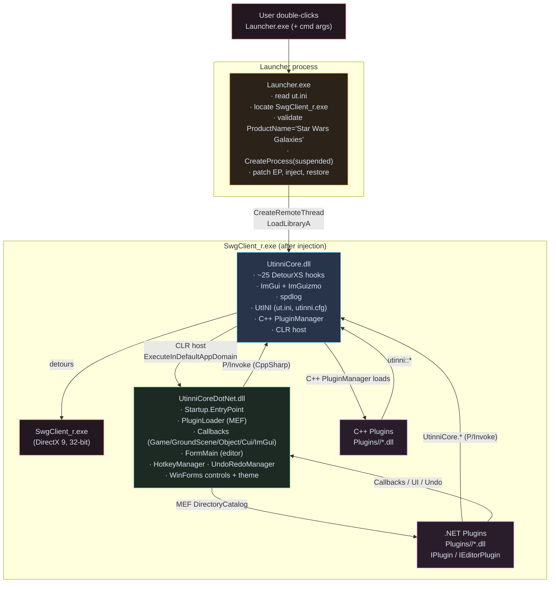
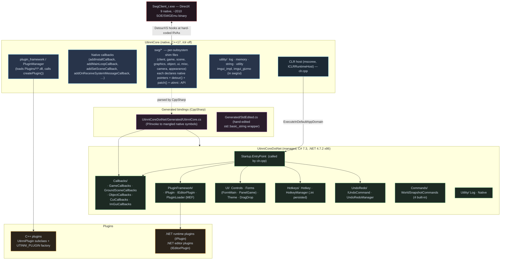
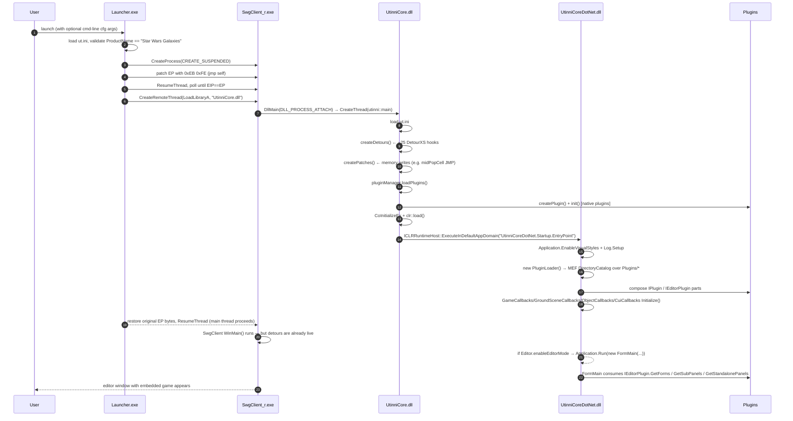

# Architecture

> Audience: everyone. This is the orientation page — read it first.

Utinni's job is to put **arbitrary user code inside a running SWG client** —
both unmanaged C++ and managed .NET — and give that code (a) the ability to
react to game events, (b) a UI it can draw, (c) a way to package itself as a
plugin, and (d) an editor host that re-parents the game window. It does this by
combining four classic techniques:

1. **Suspended-process injection** — `Launcher.exe` starts `SwgClient_r.exe`
   with `CREATE_SUSPENDED`, patches the entry point with `EB FE` (jump-to-self),
   resumes the thread, waits for `EIP` to land on the EP, calls
   `CreateRemoteThread(LoadLibraryA, "UtinniCore.dll")`, restores the EP.
2. **Function detouring** — `UtinniCore.dll`'s `DllMain` spawns a thread that
   uses [DetourXS](https://github.com/DarthTon/DetourXS) to install ~25 hooks
   at hard-coded RVAs that correspond to known SWG client functions
   (`Game::install`, `GroundScene::draw`, `CuiManager::render`, etc.).
3. **In-process CLR hosting** — once detours and C++ plugins are loaded,
   `clr::load()` calls `CLRCreateInstance` / `ICLRRuntimeHost::Start` to bring
   up the .NET v4.0.30319 runtime, then `ExecuteInDefaultAppDomain` invokes
   `UtinniCoreDotNet.Startup.EntryPoint`.
4. **MEF plugin discovery** — managed `PluginLoader` scans `Plugins/*` via
   `DirectoryCatalog`, MEF composes anything implementing `IPlugin` /
   `IEditorPlugin`, and `FormMain` wires the plugin-contributed
   `SubPanel`s, forms, hotkeys, and undo-event handlers into the editor.

## High-level topology

## Layered view

## The eight things Utinni *is*

| #  | Capability                                                              | Where it lives                                                |
| -- | ----------------------------------------------------------------------- | ------------------------------------------------------------- |
| 1  | Suspended-process injector with target validation                       | `Launcher/main.cpp`                                           |
| 2  | DetourXS-based hook installer for ~25 client functions                  | `UtinniCore/swg/*` + `utinni.cpp::createDetours()`            |
| 3  | Memory patcher (e.g. `EB FE` infinite-loop trick, JMP injection)        | `UtinniCore/utility/memory.h` + `swg/*::patch()`              |
| 4  | dearImgui + ImGuizmo overlay piggy-backing on the D3D9 device           | `UtinniCore/swg/ui/imgui_impl.*`                              |
| 5  | spdlog-backed logging, with managed sink callbacks                      | `UtinniCore/utility/log.*` + `UtinniCoreDotNet/Utility/Log.cs`|
| 6  | In-process CLR host                                                     | `UtinniCore/clr.cpp`                                          |
| 7  | C++ plugin model: subclass `UtinniPlugin`, export `createPlugin()`      | `UtinniCore/plugin_framework/`                                |
| 8  | .NET plugin model: implement `IPlugin` / `IEditorPlugin`, MEF discovery | `UtinniCoreDotNet/PluginFramework/`                           |

## The four things Utinni *gives plugin authors*

| Capability                                          | Touch point                                            | Audience          |
| --------------------------------------------------- | ------------------------------------------------------ | ----------------- |
| React to game lifecycle / scene / target / messages | `Callbacks/*.cs` (.NET) or `swg/*/add*Callback` (C++)  | All plugin authors |
| Draw editor UI (panels, forms, themed controls)     | `UI/Controls/*`, `UI/Forms/IEditorForm`                | .NET editor plugins |
| Bind hotkeys (with chord, scope, INI persistence)   | `Hotkeys/HotkeyManager`                                | .NET editor plugins |
| Push reversible edits onto an undo stack            | `IEditorPlugin.AddUndoCommand` event + `IUndoCommand`  | .NET editor plugins |

## Process lifecycle in one timeline

## Threading model (the part that bites plugin authors)

There are **three threads of consequence**:

| Thread                  | Owned by    | Runs                                                                                  |
| ----------------------- | ----------- | ------------------------------------------------------------------------------------- |
| **Game thread**         | SWG         | The main game loop. All native detours fire here. All callback delegates fire here.   |
| **UI thread** (STA)     | UtinniCoreDotNet | `FormMain` and every WinForms control. Created when `Application.Run(new FormMain())` blocks. |
| **Native init thread**  | UtinniCore  | `utinni::main()` itself runs on a thread spawned by `DllMain`; it's done after init.  |

Plugin authors must respect this division:

- **Callbacks fire on the game thread.** Touching WinForms directly from inside
  a callback throws `InvalidOperationException`. Marshal with `Control.Invoke`
  or queue work back into a callback the UI can drain.
- **WinForms input** (key/mouse on `PanelGame`) fires on the UI thread; if it
  needs to call into the game engine, it should enqueue via
  `GameCallbacks.AddMainLoopCall(...)` or `GroundSceneCallbacks.AddUpdateLoopCall(...)`.
- **Long work blocks the game.** A `Thread.Sleep` inside a callback freezes
  rendering. Move work to a background `Task` and re-marshal results.

See [Callbacks](callbacks.md) for the per-callback threading guarantees.

## Configuration files

| File                        | Owner           | Purpose                                                                  |
| --------------------------- | --------------- | ------------------------------------------------------------------------ |
| `ut.ini`                    | UtinniCore + Launcher | Master settings. Sections: `[Launcher]` (swgClientPath/Name), `[UtinniCore]` (enableEditorMode, enableInternalUi, useSwgOverrideCfg, autoLoadScene), `[Log]`, `[Plugins]` (`plugin_0=true,MyPlugin`). |
| `utinni.cfg`                | UtinniCore      | Replacement for SWG's own `client.cfg`. Loaded by the override-detour on `0x00401000`. Lets Utinni dictate `loginServerPort0/Address0`, `groundScene`, `freeChaseCameraMaximumZoom`, `splashTimeoutSeconds=0`, etc. |
| `<plugin>/settings.ini`     | per plugin      | Plugin-defined; managed via the `UtINI` native wrapper from C#.          |
| `<plugin>/input.ini`        | `HotkeyManager` | Rebound hotkeys (per plugin or per form).                                |
| `logs/utinni.log` (default) | spdlog          | All native + managed log output (sink callbacks merge them).             |

## Trust boundaries and what can break

- **Stable surface (green):** the curated managed bridge — `Callbacks/*`,
  `PluginFramework/*`, `UI/*`, `Hotkeys/*`, `UndoRedo/*`, `Commands/*`. These
  are the things plugins should depend on.
- **Wobbly (yellow):** the auto-generated bindings and the C++ shim layer.
  Public API there is mostly stable, but exact mangled entry points change
  if the headers change.
- **Fragile (red):** the hard-coded RVAs in `swg/*/*.cpp`. They are pinned to
  a specific SWG build. A different `SwgClient_r.exe` will need new
  addresses — see [Internals](internals.md).

## What's *not* in Utinni

| Out of scope                                 | Why / where it lives instead                                                       |
| -------------------------------------------- | ---------------------------------------------------------------------------------- |
| Server-side modding                          | This is *client* injection. Use SWG-Source/swg-main for server mods.               |
| Asset extraction (.tre browsing as a CLI)    | Utinni reads from the running client. Use `TreeFileExtractor.exe` (in swg-client/tools) for offline. |
| Client *source* changes                      | Out of scope; Utinni works with stock binaries. See [swg-client](../../../swg-client/docs/index.html) for source-level work. |
| Updates for non-Pre-CU builds (NGE-only, …)  | The hard-coded RVAs are pinned to the SWGEmu Pre-CU client.                        |
| Anti-cheat circumvention against live shards | Out of scope and not what this tool is for.                                        |

## Next

Continue with one of:

- [Injection & boot](injection.md) — the suspended-process technique and DllMain dance.
- [Native core](core.md) — the C++ shim catalog.
- [Managed bridge](bridge.md) — CppSharp output, FormMain wiring.
- [Plugin framework](plugin-framework.md) — `IPlugin` / `IEditorPlugin` contracts.
- [Tutorial](tutorial.md) — build a hello-world editor plugin.
