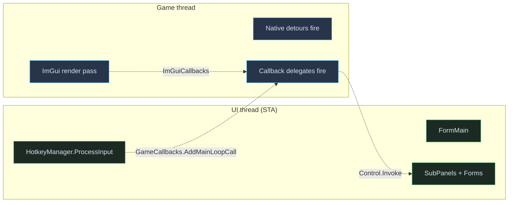

# Managed bridge (UtinniCoreDotNet)

> Audience: .NET plugin authors (this is your primary surface) and core
> contributors.

`UtinniCoreDotNet.dll` is the **only** assembly a managed plugin needs to
reference. Inside, it stitches together:

- **`Generated/`** — CppSharp-output P/Invoke wrappers over every C++
  type/function the SDK exposes.
- **`Callbacks/`** — managed delegates fired from the game thread by the
  native side.
- **`PluginFramework/`** — `IPlugin` / `IEditorPlugin` contracts and the
  MEF-based `PluginLoader`.
- **`Hotkeys/` · `UndoRedo/` · `Commands/`** — first-class editor primitives.
- **`UI/`** — `FormMain`, `PanelGame`, themed WinForms controls,
  drag-drop bridge.
- **`Utility/`** — `Log` (with class/function-name reflection) and `Native`
  (Win32 helpers).

Target framework: **.NET Framework 4.7.2, x86, C# 7.3, `AllowUnsafeBlocks=true`**.
The `x86` platform target is **non-negotiable** — the host SWG process is
32-bit, so the CLR loaded into it is 32-bit, and your DLLs must be too.

## Top-level structure

```
UtinniCoreDotNet/
├── main.cs                                ← Startup.EntryPoint (called by clr.cpp)
├── UtinniCoreDotNet.csproj                ← .NET 4.7.2 / x86 / unsafe
│
├── Generated/                             ← AUTO-GENERATED — do not edit by hand
│   ├── UtinniCore.cs                      ← ~5000+ lines, CppSharp P/Invoke output
│   └── StdEdited.cs                       ← hand-edited std::basic_string wrappers
│
├── Callbacks/
│   ├── GameCallbacks.cs                   ← install / setup-scene / cleanup-scene / pre-main / main loop
│   ├── GroundSceneCallbacks.cs            ← update / pre-draw / post-draw / camera-change
│   ├── ObjectCallbacks.cs                 ← on-target (both queued and persistent)
│   ├── CuiCallbacks.cs                    ← system messages
│   └── ImGuiCallbacks.cs                  ← gizmo enabled/disabled/position-changed/rotation-changed
│
├── PluginFramework/
│   ├── IPlugin.cs                         ← interface + PluginInformation
│   ├── IEditorPlugin.cs                   ← extends IPlugin with editor primitives
│   └── PluginLoader.cs                    ← MEF discovery, gated by ut.ini [Plugins]
│
├── Hotkeys/
│   ├── Hotkey.cs                          ← Name / ModifierKeys / Key / OnDown / scoping flags
│   └── HotkeyManager.cs                   ← Add / Load / Save / ProcessInput
│
├── UndoRedo/
│   ├── IUndoCommand.cs                    ← Execute / Undo / GetText / merge support
│   └── UndoRedoManager.cs                 ← stacks + scene-cleanup wiring
│
├── Commands/
│   └── WorldSnapshotCommands.cs           ← Add / Remove / PositionChanged / RotationChanged
│
├── UI/
│   ├── Forms/
│   │   ├── FormMain.cs                    ← the editor shell, embeds the SWG window
│   │   └── IEditorForm.cs
│   ├── Controls/
│   │   ├── PanelGame.cs                   ← hosts SwgClient_r HWND, forwards WndProc, routes hotkeys
│   │   ├── SubPanel.cs / SubPanelContainer.cs
│   │   ├── UtinniButton, UtinniToggleButton, UtinniToggle
│   │   ├── UtinniComboBox, UtinniTextbox, UtinniNumericUpDown, UtinniSlider
│   │   ├── UtinniLabel, UtinniContextMenuStrip
│   │   ├── UndoRedoListDropDown, UndoRedoTitlebarButton
│   │   └── UtinniTitlebarButton, UtinniTitlebarDropDownButton, UtinniTitlebarToggleButton
│   ├── Theme/  (Colors.cs, ThemeUtility.cs)
│   └── GameDragDropEventHandlers.cs       ← static handler hooks for the embedded game window
│
├── Utility/
│   ├── Log.cs                             ← .Info / .Warning / .Error / .Critical / .Debug with class/method prefix
│   └── Native.cs                          ← user32 P/Invokes for WndProc forwarding
│
├── Properties/AssemblyInfo.cs
└── Resources/                             ← icons used by built-in title-bar buttons
```

## `Generated/UtinniCore.cs` and `StdEdited.cs`

`UtinniCoreDotNet/Generated/UtinniCore.cs` is the output of
`UtinniCoreDotNetGen` (CppSharp). It is **5000+ lines** of generated P/Invoke
wrappers around the native C++ surface. Key shape:

```csharp
namespace UtinniCore.Utinni
{
    public unsafe partial class Game : IDisposable
    {
        public partial struct __Internal
        {
            [DllImport("UtinniCore", CallingConvention = CallingConvention.Cdecl,
                EntryPoint = "?install@Game@utinni@@SAXXZ",   // mangled C++ symbol
                ExactSpelling = true)]
            internal static extern void Install();
            // ...
        }

        public IntPtr __Instance { get; protected set; }
        internal static ConcurrentDictionary<IntPtr, Game> NativeToManagedMap = new ...;

        public static void Install() { __Internal.Install(); }
        // ...
    }
}
```

Things to know:

- **Every public C++ function in the parsed headers has a P/Invoke wrapper.**
  The mangled entry points come from a per-build symbol library called
  `UtinniCore-Symbols` (a separate project just for this).
- **Pointer ownership is tracked** via `NativeToManagedMap` per type, so the
  same native instance always projects to the same managed wrapper.
- **STL types are wrapped in `Std.BasicString<T,_Traits,_Alloc>` etc.** —
  this is what `StdEdited.cs` covers, and it's hand-edited because CppSharp's
  generic generation isn't quite right for SWG's STL layout.

You generally don't read `Generated/UtinniCore.cs` directly. Instead, the
**canonical entry-point types** plugins call are:

| Type                                              | Use                                                                            |
| ------------------------------------------------- | ------------------------------------------------------------------------------ |
| `UtinniCore.Utinni.utinni`                        | `GetConfig()`, `GetPath()`, `GetPluginManager()`.                              |
| `UtinniCore.Utinni.UtINI`                         | Read/write `.ini` files via the native wrapper.                                |
| `UtinniCore.Utinni.Game`                          | Scene loading, queries (player, target, camera).                               |
| `UtinniCore.Utinni.GroundScene`                   | Free-cam toggle, terrain reload, current camera, scene-local actions.          |
| `UtinniCore.Utinni.Client`                        | Editor mode + input suspend/resume + HWND.                                     |
| `UtinniCore.Utinni.WorldSnapshot` / `WorldSnapshotReaderWriter` | World object placement records.                                              |
| `UtinniCore.Utinni.CreatureObject.creature_object` | Player object + target-change hook.                                          |
| `UtinniCore.Utinni.SystemMessageManager`          | Send / receive system messages.                                                |
| `UtinniCore.Utinni.Network`                       | `GetObjectById` for managed-side lookups.                                      |
| `UtinniCore.Utinni.CuiIo`                         | Suspend/resume keyboard input across the SWG/UI boundary.                      |
| `UtinniCore.ImguiImpl.imgui_impl`                 | Gizmo on/off/mode/operation/snap.                                              |
| `UtinniCore.ImguiGizmo`                           | Gizmo data types.                                                              |
| `UtinniCore.DirectX.directx9`                     | D3D9 device handle, wireframe toggle, depth texture.                           |
| `UtinniCore.Swg.Math.{Transform, Vector, Quaternion}` | Math types — most plugin code goes through these directly.                  |
| `UtinniCore.Delegates`                            | Function-pointer types used by callback registrations.                         |
| `UtinniCore.Std.BasicString*` etc.                | Only if you're crossing through manually.                                      |

See [Plugin framework](plugin-framework.md) for how a plugin actually opts
into these.

## `Startup.EntryPoint` (one-shot init)

Already covered in [Injection & boot](injection.md#managed-startup) — read
that for the full flow. Summary:

1. `Application.EnableVisualStyles()`
2. `Log.Setup()` — sets up the bridge sink so native log lines flow into the
   managed log.
3. `new PluginLoader()` — discovers, gates by `[Plugins]` in `ut.ini`,
   composes via MEF.
4. `GameCallbacks/GroundSceneCallbacks/ObjectCallbacks/CuiCallbacks.Initialize()`
   — register the C# delegates with the native side. Note that
   `ImGuiCallbacks.Initialize()` is **not** called here — it's only
   initialised lazily when the editor opens, since gizmo events only flow
   when the editor is up.
5. If `Editor.enableEditorMode=true`, `Application.Run(new FormMain(pluginLoader))`.

## `FormMain` — the editor shell

`UI/Forms/FormMain.cs` is the host window:

- **Custom chrome.** No native title bar; a `UtinniTitlebar` row with
  min/max/close + plugin-added title-bar buttons. Drag-move via
  `WM_NCHITTEST` forwarding.
- **`PanelGame`** in the centre re-parents the SWG window into a WinForms
  Panel:
  - Forwards every `WndProc` message to SWG's window proc (address
    `0x00AA0970` is hardcoded — patched at install time).
  - Tracks focus to drive `OnGameFocusOnly` hotkeys.
  - On mouse-enter resumes input; on mouse-leave suspends. Cursor visibility
    is reference-counted (Windows `Cursor.Show()` semantics make this
    necessary).
- **Right rail** hosts `SubPanel`s contributed by `IEditorPlugin.GetSubPanels()`.
- **Top of right rail** has a combo selector for `IEditorPlugin.GetStandalonePanels()` —
  each plugin's standalone panels become entries.
- **Title-bar undo/redo buttons** wired to the `UndoRedoManager`.
- **Drag-drop** routed via `GameDragDropEventHandlers` — see below.

`FormMain` instantiates **one `UndoRedoManager`** for the whole editor and
subscribes each editor plugin's `AddUndoCommand` event to it.

## `PanelGame` — embedding the live game

```csharp
public class PanelGame : Panel
{
    public PanelGame() {
        GameDragDropEventHandlers.Initialize(this);  // route DragEnter/Over/Drop to static handlers
    }

    protected override void WndProc(ref Message m)
    {
        // Forward EVERY message to the SWG window proc first.
        IntPtr swgWndProc = new IntPtr(0x00AA0970);
        Native.CallWindowProc(swgWndProc, m.HWnd, m.Msg, m.WParam, m.LParam);
        base.WndProc(ref m);
    }
}
```

The `0x00AA0970` is the SWG client's `WndProc` — same RVA used by
`utinni::Client::detour()`. After UtinniCore reparents the SWG HWND into this
panel (via `Client::setHwnd`), every Windows message reaching the panel goes
to SWG, and the panel then runs WinForms processing on the same message. This
is how mouse and keyboard get into both.

## Callbacks — what fires where

See [Callbacks reference](callbacks.md) for full per-API detail. One-paragraph
summary:

- **Native-side**: `utinni::Game::addMainLoopCallback(fn)` etc. take
  `std::function<void()>`. The managed side passes a delegate down through
  P/Invoke, marshals it into a function pointer, and stores it on the C++
  side.
- **Thread**: every callback fires on the **game thread**, *not* the UI
  thread. You must marshal to UI via `Control.Invoke` if you want to touch
  WinForms. Conversely, if a UI handler wants to call game APIs, it should
  enqueue via `GameCallbacks.AddMainLoopCall(...)` or
  `GroundSceneCallbacks.AddUpdateLoopCall(...)`.
- **Two patterns** exist depending on the callback file: `SynchronizedCollection`
  (persistent — fired every event) or `ConcurrentQueue` (one-shot — fired
  once then drained).

## Hotkeys

`Hotkeys/Hotkey.cs`:

```csharp
public class Hotkey
{
    public string Name;
    public string Text;
    public Keys ModifierKeys;     // Ctrl/Shift/Alt
    public Keys Key;
    public Action OnDownCallback;
    public bool OverrideGameInput;
    public bool Enabled;
    public bool OnGameFocusOnly;
}
```

`HotkeyManager.cs`:

```csharp
public class HotkeyManager
{
    public Dictionary<string, Hotkey> Hotkeys;
    public HotkeyManager(bool onGameFocusOnly);

    public void Add(Hotkey hotkey);
    public void CreateSettings();       // seed defaults
    public void Load();                  // input.ini
    public void Save();
    public void ProcessInput(Keys mods, Keys key, bool isGameFocused);
}
```

Wiring: each plugin returns its own `HotkeyManager` from `IEditorPlugin.GetHotkeyManager()`.
`FormMain` registers a key-down handler on `PanelGame` that calls
`ProcessInput` on every plugin's manager. Hotkeys with `OnGameFocusOnly=true`
fire only when `PanelGame` has focus; ones with `OverrideGameInput=true`
suspend native keyboard input during dispatch.

Persistence: `Load()` reads `<plugin-assembly-dir>/input.ini`. `Save()` writes
it back. Users can rebind via the editor's settings UI.

## Undo / Redo

`UndoRedo/IUndoCommand.cs`:

```csharp
public interface IUndoCommand
{
    string GetText();              // human label, shown in dropdown list
    void Execute();                // redo: apply
    void Undo();                   // reverse
    bool AllowMerge();
    bool Merge(IUndoCommand newCommand);  // attempt to absorb the next command
}
```

`UndoRedo/UndoRedoManager.cs`:

```csharp
public class UndoRedoManager
{
    public Stack<IUndoCommand> UndoCommands;
    public Stack<IUndoCommand> RedoCommands;

    public UndoRedoManager(Action onUpdate, Action undo, Action redo);
    public void AddUndoCommand(IEditorPlugin editorPlugin);   // wires event
    public void Undo(int count = 1);
    public void Redo(int count = 1);
}
```

Plugin pattern:

```csharp
// Inside an IEditorPlugin implementation
AddUndoCommand?.Invoke(this, new AddUndoCommandEventArgs(
    new WorldSnapshotNodePositionChangedCommand(node, oldT, newT)));
```

The manager:

1. Clears the redo stack (forward edits invalidate redo).
2. If the top of the undo stack is `AllowMerge`-able with the new command and
   `Merge()` returns true → the new command was absorbed.
3. Otherwise → push.

`AddUndoCommand` is wired by `FormMain` once per plugin. The manager itself
also subscribes to `GameCallbacks.AddCleanupSceneCall` to clear both stacks
when the scene unloads — undo history doesn't survive a scene change.

## Built-in commands

`Commands/WorldSnapshotCommands.cs` ships four `IUndoCommand` implementations
that the Jawa Toolbox uses out-of-the-box:

| Command                                          | Execute                                                      | Undo                                       |
| ------------------------------------------------ | ------------------------------------------------------------ | ------------------------------------------ |
| `AddWorldSnapshotNodeCommand`                    | `WorldSnapshot.AddNode(node)`                                | Remove node by `ParentId`                   |
| `RemoveWorldSnapshotNodeCommand`                 | Remove node                                                  | Re-add stored copy                          |
| `WorldSnapshotNodePositionChangedCommand`        | Set object position, refresh + DetailLevelChanged            | Restore original position                   |
| `WorldSnapshotNodeRotationChangedCommand`        | Set object rotation                                          | Restore original rotation                   |

All four use `GroundSceneCallbacks.AddUpdateLoopCall` internally so that the
actual native mutation happens on the game thread, even if you fire them from
a UI event handler.

## UI theme

`UI/Theme/Colors.cs`:

```csharp
public static class Colors
{
    public enum Themes { Custom, Dark, Light }
    public static Themes Theme = Themes.Dark;

    public const float DisabledScalar  = 0.8f;
    public const float HighlightScalar = 1.25f;
    public const float PressedScalar   = 1.5f;

    public static Color Primary()      => Dark ? Argb(40,40,40)   : Argb(238,238,238);
    public static Color Secondary()    => Argb(0,122,204);
    public static Color Font()         => Dark ? WhiteSmoke       : Argb(238,238,238);
    public static Color FontDisabled() => /* ... */;
    public static Color ControlBorder() => /* ... */;
}
```

`UI/Theme/ThemeUtility.cs`:

```csharp
public static Bitmap UpdateImageColor(Bitmap, Color old, Color @new);
public static Color  ScaleColor(Color, float scalar);
```

The themed controls (`UtinniButton`, `UtinniToggleButton`, etc.) query these
at paint time rather than caching, so changing `Colors.Theme` repaints
everything automatically.

## Drag-drop bridge

`UI/GameDragDropEventHandlers.cs`:

```csharp
public static class GameDragDropEventHandlers
{
    public static DragEventHandler OnDragDrop;
    public static DragEventHandler OnDragEnter;
    public static EventHandler     OnDragLeave;
    public static DragEventHandler OnDragOver;

    public static void Initialize(Control gamePanel) { /* wire to .DragXxx */ }
}
```

This is the gateway for "drag from a WinForms tree-view, drop into the live
game world." The object browser in Jawa Toolbox uses this — see
[UtinniPlugins/docs](../../../UtinniPlugins/docs/) for the implementation.

## Utility — `Log` and `Native`

`Utility/Log.cs`:

```csharp
Log.Info("hello");          // prefixed with [Class][Method] if ut.ini → [Log] enables them
Log.Warning(...);
Log.Error(...);
Log.Critical(...);
Log.Debug(...);

Log.InfoSimple(...);        // unprefixed

Log.AddOuputSinkCallback(s => textBox.AppendText(s));
```

Implementation: introspects the call stack with `StackTrace` to find the
caller's class/method names; reads `ut.ini → [Log] writeClassName /
writeFunctionName` to decide whether to prepend; delegates to the native
`utinni::log::*`.

`Utility/Native.cs`: `WM_SYSCOMMAND`, `WM_NCHITTEST`, `WM_MOUSEMOVE`,
`SC_DRAGMOVE`/`MINIMIZE`/`MAXIMIZE`/`RESTORE`, `HT*` enum, and P/Invokes for
`user32.dll!ReleaseCapture`, `SendMessage`, `GetAsyncKeyState`,
`CallWindowProc`. Used by the custom title bar and `PanelGame`'s WndProc
forwarding.

## Threading at a glance



Things that look easy but aren't:

- **Don't open a `MessageBox` from a callback.** Modal dialogs on the game
  thread freeze rendering. Either `Control.Invoke` to UI or set a flag and
  show the dialog later.
- **WinForms timers fire on the UI thread**, but the work they do may want
  to read game state. Read it through callbacks (queued) and let the timer
  paint results.
- **Long-running background work belongs in `Task.Run`**, with results
  marshalled back via `Control.Invoke` or via `*Callbacks.Add*Call`. The
  Jawa Toolbox object browser uses this pattern when it scans the
  `object/` tree.

## Known sharp edges in the bridge

1. **`GroundSceneCallbacks.DequeuePostDrawLoopCalls` dequeues the *pre*-draw
   queue.** Bug on line ~99 of the file. If you queue something for after the
   draw, it currently fires *before*. Workaround: queue to the update loop
   instead.
2. **`OverrideGameInput` hotkeys** use a multi-stage queue dance to suspend
   game input; not frame-perfect. If you need a tight grab of a key, prefer
   suspending input explicitly via `utinni.Client.SuspendInput()` /
   `ResumeInput()`.
3. **MEF composition order is filesystem-order**, i.e. effectively
   undefined. Don't write plugins that depend on another plugin's
   constructor having already run.
4. **Cursor visibility uses a counter hack** because `Cursor.Hide()` /
   `Cursor.Show()` don't have predictable nesting.
5. **`PanelGame` forwards WndProc with a hardcoded SWG WndProc address
   (`0x00AA0970`).** That's pinned to the same client build as all the
   other RVAs.

## See also

- [Plugin framework](plugin-framework.md)
- [Callbacks reference](callbacks.md)
- [UI framework](ui-framework.md)
- [Hotkeys](hotkeys.md) · [Undo / Redo](undo-redo.md)
- [Regenerating bindings](regen-bindings.md) — when and how to re-run
  `UtinniCoreDotNetGen`.
