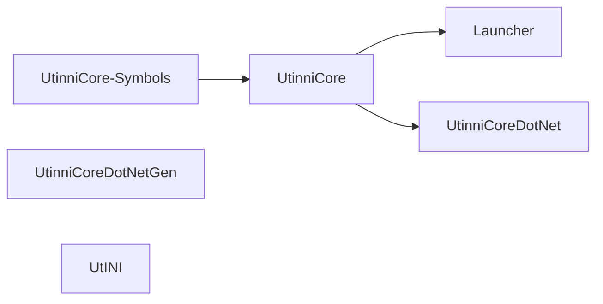

# Build & run

> Audience: everyone.

## What you need

| Tool                                          | Version                              | Why                                               |
| --------------------------------------------- | ------------------------------------ | ------------------------------------------------- |
| Visual Studio 2019                            | 16.x with **C++ desktop development** + **.NET desktop development** | The solution targets `v142` C++ toolset and .NET Framework 4.7.2. |
| Windows 10 SDK                                | 10.0.19041.0 or later                | Targeted by the C++ projects.                     |
| DirectX 9 SDK (June 2010)                     | for `RelWithDbgInfo`-configured graphics debugging | Optional but the project files reference it under that configuration. |
| .NET Framework 4.7.2 Targeting Pack           | matches the runtime                  | Build target for managed projects.                |
| The SWG client                                | Pre-CU SWGEmu / SWG-Source variant   | Target process. Utinni validates `ProductName == "Star Wars Galaxies"`. |
| (optional) VSIX SDK                           | Microsoft.VisualStudio.SDK 16.x      | Only needed if you want to build the plugin-template VSIX. |
| 5–10 GB free disk                             | —                                    | Mostly for VS, SDKs, and intermediates.           |

The whole solution builds for **x86 only** — the SWG client is 32-bit.

## Repo layout for build

```
Utinni/
├── Utinni.sln                          ← open this in VS 2019
├── Launcher/Launcher.vcxproj
├── UtinniCore/UtinniCore.vcxproj
├── UtinniCore-Symbols/UtinniCore-Symbols.vcxproj
├── UtinniCoreDotNet/UtinniCoreDotNet.csproj
├── UtinniCoreDotNetGen/UtinniCoreDotNetGen.csproj
├── UtINI/UtINI.vcxproj
├── data/                               ← Icons, ut.ini template, utinni.cfg template
├── external/                           ← vendored CppSharp, DetourXS, ImGuizmo, LeksysINI, imgui, nvapi, spdlog
└── sdk/, docs/, etc.
```

## Build the solution

1. Open `Utinni.sln` in Visual Studio 2019.
2. Select **`x86`** in the configuration platform dropdown.
3. Select **`Release`** (or `RelWithDbgInfo` if you want PDBs).
4. **Build → Build Solution** (Ctrl+Shift+B).

Dependencies build in this order automatically:



`UtinniCoreDotNet`'s post-build *can* regenerate the CppSharp bindings via
`UtinniCoreDotNetGen.exe` — see [Regenerating bindings](regen-bindings.md).
In normal builds the existing `Generated/UtinniCore.cs` is used as-is.

### Configurations

| Configuration       | Optimisation | PDBs                  | When to use                                           |
| ------------------- | ------------ | --------------------- | ----------------------------------------------------- |
| `Debug`             | Off          | Yes                   | Debugging C++. Significant runtime perf cost.          |
| `Release`           | On           | No                    | Normal use / distribution.                             |
| `RelWithDbgInfo`    | On           | Yes (full PDBs)       | Profile / mid-debug. Use this if you want to attach a debugger to a release-perf client. |

### Common build failures

| Symptom                                                | Cause                                                                                          |
| ------------------------------------------------------ | ---------------------------------------------------------------------------------------------- |
| `Cannot open input file 'UtinniCore-Symbols.lib'`      | UtinniCore-Symbols hasn't been built yet. Right-click the project → Build, then rebuild Core.  |
| `error MSB4019` referring to a missing DirectX SDK     | Open `RelWithDbgInfo` config and either install DXSDK_DIR=`C:\Program Files (x86)\Microsoft DirectX SDK (June 2010)\` or switch to `Release`. |
| Managed compile error in `Generated/UtinniCore.cs`     | Regenerate (see below). If you just changed C++ public headers, you must regenerate.            |
| `MEF composition exception` at runtime                 | A plugin in `Plugins/` references a different `UtinniCoreDotNet.dll` than the one in your install. Same DLL identity required. |

## Install layout

Copy the build output into the SWG client folder (or any folder you'll
launch from):

```
<install>/                        ← anywhere; doesn't have to be inside the client dir
├── Launcher.exe                  ← from bin\<Config>\
├── UtinniCore.dll                ← from bin\<Config>\
├── UtinniCoreDotNet.dll          ← from bin\<Config>\
├── ut.ini                        ← from data\ (edit before first run)
├── utinni.cfg                    ← from data\
├── Icons/                        ← from data\
└── Plugins/
    └── <YourPlugin>/
        └── ...
```

Notes:

- The build system copies `data/` to `bin/<Config>/` automatically (see
  the UtinniCore post-build step). You can run directly from there.
- `Launcher.exe` reads `ut.ini` from **its own directory**, not the SWG
  client's directory.

## First-run setup

Edit `ut.ini` before first launch:

```ini
[Launcher]
swgClientPath =                ; will pop a file dialog if blank
swgClientName =

[UtinniCore]
enableEditorMode    = true     ; set false for headless plugins only
enableInternalUi    = false    ; developer ImGui panels
useSwgOverrideCfg   = true     ; use utinni.cfg instead of client.cfg
autoLoadScene       = false

[Log]
writeClassName      = false
writeFunctionName   = false

[Plugins]
plugin_0 = true,TheJawaToolbox
```

Then run `Launcher.exe` (optionally with the `-- -s <Section> key=value`
config passthrough — see [Injection — Command-line passthrough](injection.md#command-line-passthrough)).

## Iterating on a plugin

The fast loop:

1. Build your plugin project — output lands in `bin/<Config>/Plugins/<YourPlugin>/`
   thanks to `Directory.Build.props` (or your own post-build copy).
2. Quit the launcher / SWG client. **Plugins are loaded once at injection** —
   there is no hot-reload.
3. Re-run `Launcher.exe`.

For C++ plugins, link errors usually mean the `UtinniCore.lib` reference
needs updating; the VSIX scaffolding handles this for .NET, but for C++ you
maintain the include/lib paths yourself.

## Attaching a debugger

### To the launcher

```
Debug → Other Targets → ... → process: Launcher.exe
```

Useful for injection-time issues. Once injection succeeds the launcher
process terminates.

### To the SWG client (managed code)

After the editor opens:

```
Debug → Attach to Process → SwgClient_r.exe → Attach to: Managed (v4.x), Native
```

You'll see breakpoints fire in WinForms event handlers, callbacks, etc.

### To the SWG client (native code)

Same as above but **Attach to: Native** only. You'll need PDBs — use the
`RelWithDbgInfo` build for `UtinniCore.dll`. The SWG client itself has no
PDBs available, so you'll see lots of `?? + 0x...` frames for the lower
half of stacks.

The `Launcher/main.cpp` has commented-out code for **automatic
Visual-Studio-DTE attach on injection** — disabled because it was flaky.
If you want to revive it, see the `#if defined RELDBG || defined _DEBUG`
section.

## Logs

By default, logs go to `<install>/logs/utinni.log` (rotated by spdlog) and
into the in-game ImGui log panel if `enableInternalUi=true`. The editor's
bottom rail also tails the log.

Toggle verbosity per-class via `ut.ini → [Log]`:

```ini
[Log]
writeClassName    = true   ; prefix every line with [ClassName]
writeFunctionName = true   ; ...and [MethodName]
```

## Distribution

For a release archive, the minimal contents are:

```
Utinni/
├── Launcher.exe
├── UtinniCore.dll
├── UtinniCoreDotNet.dll
├── ut.ini       (with sane defaults; clear out plugin_N entries)
├── utinni.cfg
└── Icons/
```

…then your `Plugins/` tree if you're bundling specific ones.

## See also

- [Injection & boot](injection.md) — what `Launcher.exe` actually does.
- [SDK & templates](sdk.md) — fastest path to a new plugin project.
- [Regenerating bindings](regen-bindings.md) — when you change C++ headers.
