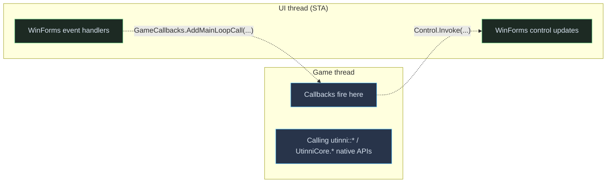

# Callbacks reference

> Audience: .NET plugin authors. C++ plugin authors use the underlying
> `utinni::<Subsystem>::add*Callback()` C++ functions — same shape, fewer
> guardrails. See [Native core](core.md).

Every Utinni callback fires on the **game thread**, never the UI thread.
Read the threading note at the bottom before writing event handlers.

There are five callback hubs:

| Hub                                | Fires on…                          | Use for…                                                       |
| ---------------------------------- | ---------------------------------- | -------------------------------------------------------------- |
| [`GameCallbacks`](#gamecallbacks)  | install, scene setup/cleanup, main loop | Anything related to engine lifecycle.                          |
| [`GroundSceneCallbacks`](#groundscenecallbacks) | per-frame update + draw, camera change | Per-frame work tied to the ground scene (the gameplay scene).  |
| [`ObjectCallbacks`](#objectcallbacks) | target change                      | "Player just targeted something."                              |
| [`CuiCallbacks`](#cuicallbacks)    | system messages                    | Chat-stream events.                                            |
| [`ImGuiCallbacks`](#imguicallbacks)| gizmo enable / disable / move / rotate | Editor manipulation of objects.                                |

All five are static classes with a one-time `Initialize()` and a series of
`Add*Callback`/`Add*Call` methods. There's no `Remove*` — callbacks live for
the session.

## Two registration patterns

Looking at the source you'll see two patterns:

### Persistent (`SynchronizedCollection<Action>`)

```csharp
public static void AddInstallCallback(Action callback) => installCallbacks.Add(callback);

private static void OnInstall()
{
    foreach (var cb in installCallbacks) cb.Invoke();
}
```

Fires **on every event**. Use this for any callback you want to keep
listening for the whole session.

### One-shot (`ConcurrentQueue<Action>`)

```csharp
public static void AddMainLoopCall(Action call) => mainLoopCallQueue.Enqueue(call);

private static void OnMainLoop()
{
    while (mainLoopCallQueue.TryDequeue(out var call)) call.Invoke();
}
```

Fires **once** then drains. Use this to schedule a single piece of work to
run on the game thread.

This naming distinction (`Callback` = persistent, `Call` = one-shot) is
inconsistent across files — the table below tells you which is which.

## `GameCallbacks`

Engine lifecycle.

| Method                                    | Pattern    | Fires…                                                                       |
| ----------------------------------------- | ---------- | ---------------------------------------------------------------------------- |
| `AddInstallCallback(Action)`              | Persistent | Once, after `Game::install()` returns. Engine subsystems are now ready.      |
| `AddSetupSceneCall(Action)`               | Persistent | When a scene loads (`Game::setupScene`).                                     |
| `AddCleanupSceneCall(Action)`             | Persistent | When a scene unloads (`Game::cleanupScene`). **Also clears the undo stack** — `UndoRedoManager` subscribes here. |
| `AddPreMainLoopCall(Action)`              | One-shot   | Once on the next pre-main-loop tick.                                         |
| `AddMainLoopCall(Action)`                 | One-shot   | Once on the next main-loop tick.                                             |

When to use which:

- **`AddInstallCallback`** — populate dropdowns / lists from the SWG
  repository (e.g. enumerate available terrains). Things you only need to
  read once at startup.
- **`AddSetupSceneCall` / `AddCleanupSceneCall`** — enable/disable your UI
  controls based on whether a scene is loaded.
- **`AddMainLoopCall`** — one-time game-thread work scheduled from the UI.
  Example: "user clicked Load Scene → enqueue `Game.LoadScene(...)` here."

### Example

```csharp
public class MyPlugin : IEditorPlugin
{
    public MyPlugin()
    {
        // Persistent: stays for the session.
        GameCallbacks.AddSetupSceneCall(() =>
            Log.Info("scene loaded — " + Game.GetGroundScene().GetName()));

        GameCallbacks.AddCleanupSceneCall(() => Log.Info("scene unloaded"));
    }

    private void OnLoadButtonClicked(object sender, EventArgs e)
    {
        // One-shot: defer the actual game call to the next tick.
        GameCallbacks.AddMainLoopCall(() =>
            Game.LoadScene("terrain/naboo.trn",
                           "object/creature/player/shared_human_male.iff"));
    }
    // ...
}
```

## `GroundSceneCallbacks`

Per-frame, scoped to the ground scene (the gameplay scene — *not* the login
screen / character select).

| Method                                    | Pattern    | Fires…                                                                |
| ----------------------------------------- | ---------- | --------------------------------------------------------------------- |
| `AddUpdateLoopCall(Action)`               | One-shot   | Next `GroundScene::update`.                                            |
| `AddPreDrawLoopCall(Action)`              | One-shot   | Next pre-draw (before `GroundScene::draw`).                            |
| `AddPostDrawLoopCall(Action)`             | One-shot   | **Bug — currently drains the pre-draw queue.** Use the update loop instead until this is fixed. |
| `AddCameraChangeCallback(Action)`         | Persistent | Camera index changed (e.g. free-cam toggled).                          |

### When to choose update vs pre-draw

| Operation                                   | Recommended hook         | Why                                                          |
| ------------------------------------------- | ------------------------ | ------------------------------------------------------------ |
| Move/rotate/spawn an object                 | `AddUpdateLoopCall`      | Objects are touched as part of update; safe.                 |
| Toggle/configure ImGuizmo                   | `AddPreDrawLoopCall`     | Gizmo state needs to be set before the draw uses it.         |
| Read camera state, copy to UI               | `AddUpdateLoopCall`      | Camera is final by update time.                              |
| Heavy compute (>1 ms)                       | Background `Task`        | Don't run on the game thread directly — marshal results.     |

### Example

```csharp
public class FreeCamPanel : SubPanel
{
    private void btnTeleportToOrigin_Click(object sender, EventArgs e)
    {
        GroundSceneCallbacks.AddUpdateLoopCall(() =>
        {
            var cam = GroundScene.Get().GetCurrentCamera();
            cam.SetTransform(new Transform(Vector.Zero, Quaternion.Identity));
        });
    }
}
```

## `ObjectCallbacks`

Target-object tracking. Wraps `CreatureObject::setTarget`.

| Method                                    | Pattern    | Fires…                                                       |
| ----------------------------------------- | ---------- | ------------------------------------------------------------ |
| `AddOnTargetCall(Action)`                 | One-shot   | Next target change.                                          |
| `AddOnTargetCallback(Action)`             | Persistent | Every target change for the session.                         |

Both fire **after** the target has been set; you read the current target via
`Game.GetPlayerLookAtTargetObject()` or similar.

### Example

```csharp
ObjectCallbacks.AddOnTargetCallback(() =>
{
    var t = Game.GetPlayerLookAtTargetObject();
    Log.Info("target → " + (t?.GetTemplateName() ?? "(none)"));
});
```

## `CuiCallbacks`

UI system events. Currently exposes the system-message stream.

| Method                                              | Pattern    | Fires…                                              |
| --------------------------------------------------- | ---------- | --------------------------------------------------- |
| `AddOnReceiveSystemMessageCallback(Action<string>)` | Persistent | On every system message (e.g. "You gain XP").       |

### Example

```csharp
CuiCallbacks.AddOnReceiveSystemMessageCallback(msg =>
{
    if (msg.Contains("XP"))
        Log.Info("XP event: " + msg);
});
```

## `ImGuiCallbacks`

Editor manipulator events. Initialised lazily by `FormMain` — only active
in editor mode.

| Method                                        | Pattern    | Fires…                                                                  |
| --------------------------------------------- | ---------- | ----------------------------------------------------------------------- |
| `AddOnEnabledCallback(Action)`                | Persistent | Gizmo turned on (via `imgui_impl.Enable(target)`).                       |
| `AddOnDisabledCallback(Action)`               | Persistent | Gizmo turned off.                                                        |
| `AddOnPositionChangedCallback(Action)`        | Persistent | User dragged the translate gizmo. New position is on the target object. |
| `AddOnRotationChangedCallback(Action)`        | Persistent | User rotated via the gizmo.                                              |

These fire on the game thread, inside the draw loop. Read state via
`Network.GetObjectById(id)` or the target object directly.

### Example: pushing undo commands on gizmo edits

```csharp
public class SnapshotImpl
{
    private Transform beforeTransform;

    public SnapshotImpl(IEditorPlugin owner)
    {
        ImGuiCallbacks.AddOnEnabledCallback(() =>
        {
            var obj = Game.GetPlayerLookAtTargetObject();
            beforeTransform = obj.GetTransform();
        });

        ImGuiCallbacks.AddOnPositionChangedCallback(() =>
        {
            var obj = Game.GetPlayerLookAtTargetObject();
            var node = WorldSnapshot.GetNodeForObject(obj);
            owner.AddUndoCommand?.Invoke(this,
                new AddUndoCommandEventArgs(
                    new WorldSnapshotNodePositionChangedCommand(
                        node, beforeTransform, obj.GetTransform())));
            beforeTransform = obj.GetTransform();
        });
    }
}
```

## Threading discipline (the cheat sheet)



Rules:

1. **From a callback** — to update WinForms, marshal to UI: `myLabel.Invoke((MethodInvoker)(() => myLabel.Text = "..."))`.
2. **From a WinForms event handler** — to call game APIs, enqueue:
   `GameCallbacks.AddMainLoopCall(() => Game.LoadScene(...))`.
3. **From a `Task.Run`** — do compute, then marshal to UI for display *or*
   enqueue a callback if you also need a game-thread effect.
4. **Avoid `Thread.Sleep`** in any callback. Avoid synchronous waits on
   anything that depends on the game thread (deadlock).
5. **Don't open modal dialogs** from callbacks. `MessageBox.Show` will freeze
   the game while waiting for user input. Marshal to UI first, then show.
6. **Don't call `Application.DoEvents`** anywhere — it pumps message
   re-entrancy in ways that fight `PanelGame`'s WndProc forwarding.

## Known issues

- **`AddPostDrawLoopCall` is bugged.** As of the surveyed source, it
  dequeues the *pre*-draw queue rather than the post-draw queue. Workaround:
  use `AddUpdateLoopCall` and accept one-frame latency, or fork and fix.
- **`ImGuiCallbacks` is initialised inside `FormMain`**, not in
  `Startup.EntryPoint`. Runtime plugins (no editor) won't see gizmo events
  because there's no gizmo without the editor.
- **No `Remove*` for callbacks.** Once subscribed, you're subscribed for the
  process lifetime. If you need a one-shot, use the queue-style `Add*Call`.

## See also

- [Bridge](bridge.md) — where these systems sit in the broader managed surface.
- [Native core — Game / GroundScene / SystemMessageManager](core.md) — the
  C++ side these wrap.
- [Tutorial](tutorial.md) — uses every callback type at least once.
