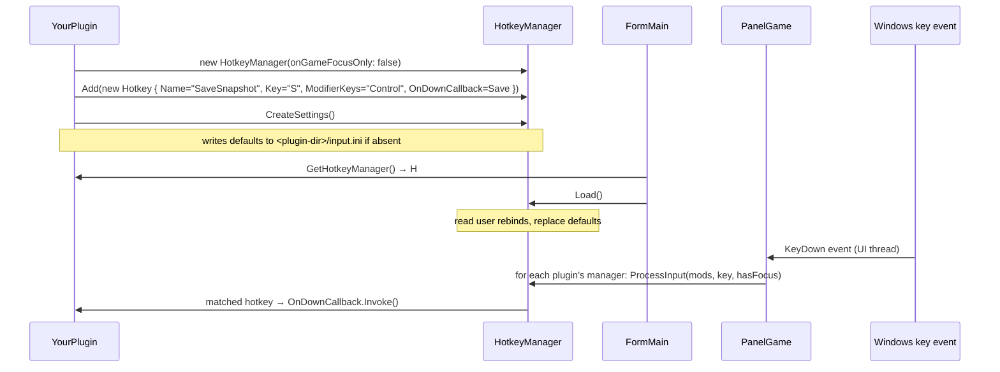

# Hotkeys

> Audience: .NET editor plugin authors.

The hotkey system gives plugins:

- Named, chord-capable bindings (e.g. `Control + Shift + S`).
- Per-plugin persistence to `<plugin-dir>/input.ini` — users can rebind.
- Scope flags: only-when-game-has-focus, override-game-input.
- Runtime enable/disable per hotkey ID for context-sensitive shortcuts.

It lives in `UtinniCoreDotNet/Hotkeys/`.

## `Hotkey`

```csharp
public class Hotkey
{
    public string Name;              // unique identifier (also the .ini key)
    public string Text;              // human-readable label for the settings UI
    public Keys   ModifierKeys;      // bitwise: Ctrl / Shift / Alt
    public Keys   Key;               // main key
    public Action OnDownCallback;    // invoked on key-down
    public bool   OverrideGameInput; // if true, suspend native game input while dispatching
    public bool   Enabled;           // can be flipped at runtime
    public bool   OnGameFocusOnly;   // if true, only fires when PanelGame has focus
}
```

The `Keys` enum is `System.Windows.Forms.Keys`. Modifiers are combined with
`Keys.Control | Keys.Shift`.

## `HotkeyManager`

```csharp
public class HotkeyManager
{
    public Dictionary<string, Hotkey> Hotkeys;

    public HotkeyManager(bool onGameFocusOnly);
    public void Add(Hotkey hotkey);
    public void CreateSettings();            // seed defaults into the .ini if missing
    public void Load();                       // read user-customised bindings from .ini
    public void Save();
    public void ProcessInput(Keys mods, Keys key, bool isGameFocused);
}
```

### Lifecycle



### Authoring pattern

```csharp
public class MyEditorPlugin : IEditorPlugin
{
    private readonly HotkeyManager hotkeys;

    public MyEditorPlugin()
    {
        hotkeys = new HotkeyManager(onGameFocusOnly: true);

        hotkeys.Add(new Hotkey
        {
            Name           = "ReloadScene",
            Text           = "Reload current scene",
            ModifierKeys   = Keys.Control | Keys.Shift,
            Key            = Keys.R,
            OnDownCallback = () => GameCallbacks.AddMainLoopCall(
                                       () => GroundScene.Get().ReloadTerrain()),
            OverrideGameInput = false,
            Enabled        = true,
            OnGameFocusOnly = true
        });

        hotkeys.Add(new Hotkey
        {
            Name           = "ToggleSnapshotEditing",
            Text           = "Toggle snapshot node editing",
            ModifierKeys   = Keys.None,
            Key            = Keys.Oemtilde,    // the backtick / tilde key
            OnDownCallback = ToggleNodeEditing,
            OverrideGameInput = true,
            Enabled        = true,
            OnGameFocusOnly = false             // works whether or not the game panel has focus
        });

        hotkeys.CreateSettings();
    }

    public HotkeyManager GetHotkeyManager() => hotkeys;
    // ...
}
```

### `OverrideGameInput`

When a matched hotkey has `OverrideGameInput=true`, the dispatcher:

1. Queues a `GameCallbacks.AddPreMainLoopCall` that calls
   `CuiIo.DisableKeyboard()`.
2. Queues the user callback to fire on the *next* main-loop tick.
3. Queues another pre-main-loop call to re-enable keyboard on the tick
   after that.

This indirection is a workaround — SWG processes the key before WinForms
sees it, so we need a brief window where SWG ignores keyboard input. It is
**not frame-perfect**; for tight grabs of a key, explicitly call
`utinni.Client.SuspendInput()` / `ResumeInput()` around your section.

### Dynamic enable/disable

```csharp
hotkeys.Hotkeys["SaveSnapshot"].Enabled = sceneIsLoaded;
hotkeys.Hotkeys["SetGizmoTranslate"].Enabled = gizmoIsActive;
```

The Jawa Toolbox uses this heavily: it registers hotkeys once, then toggles
their `Enabled` flag in response to scene-state and gizmo-state callbacks.

### Persistence — `input.ini` format

`HotkeyManager.Save()` writes a simple format:

```ini
[Hotkeys]
ReloadScene           = Control + Shift + R
ToggleSnapshotEditing = Oemtilde
SaveSnapshot          = Control + S
```

…where the value is `[mod1 + mod2 + ...] + Key`. Modifier order is
canonicalised by the manager. Users can hand-edit this file or use the
in-editor settings UI to rebind.

`CreateSettings()` only adds an entry if absent — running it is idempotent.

`Load()` overrides in-memory defaults with whatever's on disk.

## How dispatch works inside `PanelGame`

`UI/Controls/PanelGame.cs` registers `PanelGame_KeyDown`:

```csharp
private void PanelGame_KeyDown(object sender, KeyEventArgs e)
{
    foreach (var plugin in pluginLoader.Plugins.OfType<IEditorPlugin>())
    {
        var hm = plugin.GetHotkeyManager();
        if (hm == null) continue;
        hm.ProcessInput(e.Modifiers, e.KeyCode, this.HasFocus);
    }
}
```

Inside `ProcessInput`:

1. For each `Hotkey` in `Hotkeys`:
   - Skip if `!Enabled`.
   - Skip if `OnGameFocusOnly && !isGameFocused`.
   - Match modifier + key bitwise.
2. On match → invoke `OnDownCallback`. If `OverrideGameInput`, wrap as
   above.

There is **no priority ordering** between plugins — if two plugins both
register `Control+S`, both fire. Choose distinct hotkey names; consider
using a plugin-prefix in the `Name` field (e.g. `MyPlugin.SaveScene`).

## Concurrency gotchas

- **`OnDownCallback` runs on the UI thread.** Don't call game APIs
  synchronously — marshal via `GameCallbacks.AddMainLoopCall`.
- **Long handlers freeze WinForms input.** If you need to compute, fork to
  a `Task`.
- **Holding a key** fires multiple `OnDownCallback`s (one per autorepeat).
  If you want edge-triggered semantics, track state with a boolean field.

## Settings UI

The editor's hotkey-rebinding UI (a built-in form) presents every
registered manager. The `Text` field is shown to the user; the `Name` field
is the storage key. Both are required — don't leave `Text` empty or your
hotkey shows up as "" in the rebinder.

## See also

- [Plugin framework](plugin-framework.md) — `IEditorPlugin.GetHotkeyManager()`.
- [Callbacks reference](callbacks.md) — what to chain to from a hotkey.
- [Bridge — Threading](bridge.md#threading-at-a-glance).
