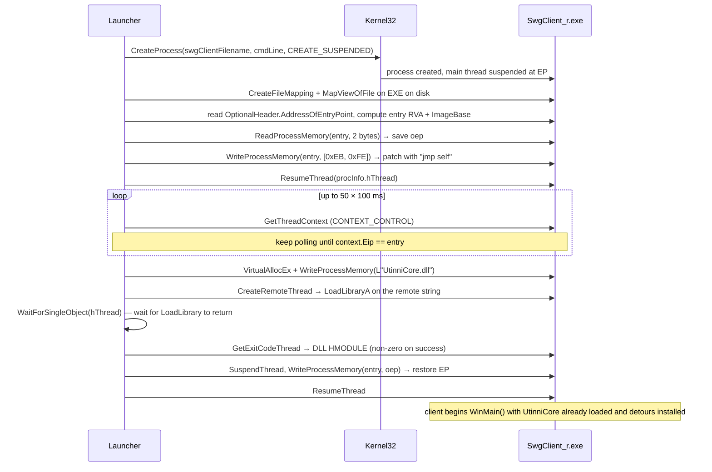

# Injection & Boot

> Audience: core contributors and curious plugin authors. This page covers
> the **launch → injection → DllMain → CLR** sequence in detail. If you only
> want to write a plugin, skip to [Plugin framework](plugin-framework.md).

## Why injection (vs. modifying the binary)

SWG's `SwgClient_r.exe` is a closed-source ~2010 SOE binary. The community
runs it unmodified — patching the EXE on disk would break update workflows and
many shards refuse to authenticate modified clients. Utinni's solution is the
classical injector pattern:

1. Spawn the target process **suspended** so it hasn't executed a single
   instruction yet.
2. Force it to load `UtinniCore.dll` *before* `WinMain` runs, so our detours
   are in place before any client code touches the functions we want to hook.
3. Release the process and let it run normally.

The two pieces are `Launcher/main.cpp` (out-of-process) and
`UtinniCore/utinni.cpp::main()` (in-process, runs after injection).

## The launcher

### Inputs

- **`ut.ini`** in the same directory as `Launcher.exe`. Specifically
  `[Launcher] swgClientPath=` and `swgClientName=`.
- **Command-line args** — anything after `--` is forwarded to the client as
  config overrides (see [Command-line passthrough](#command-line-passthrough)).

### Target discovery & validation

`Launcher/main.cpp::getSwgClientFilename()`:

1. Read `swgClientPath` and `swgClientName` from `ut.ini`.
2. If either is empty, the wrong extension, or the file doesn't exist —
   pop a `GetOpenFileName` dialog asking the user to point at their client.
   Persist the answer back to `ut.ini`.
3. Read the file's `VERSIONINFO` resource and check `ProductName == "Star
   Wars Galaxies"`. If not, clear the cached path and bail with a message
   box. This is the **only** guard that the user picked a real SWG client.

```cpp
// From Launcher/main.cpp
if (VerQueryValue(targetVersionInfo, "...ProductName", ..., &verInfoSize) &&
    strcmp(targetProductName, "Star Wars Galaxies") != 0)
{
    throwError("[ERROR] Target client is not a valid SWG client.");
}
```

### The injection dance

`Launcher/main.cpp::loadDll()`:



### Why `0xEB 0xFE`?

`EB FE` is the x86 instruction `jmp $` — branch to the byte you're standing
on, i.e. an infinite-tight-loop. Used here as a **synchronization primitive**:

- We can't rely on `CREATE_SUSPENDED` keeping the thread suspended forever
  while we inject — the launcher needs the thread alive so `CreateRemoteThread`
  has a worker.
- After `ResumeThread`, the main thread will run loader code, fix up imports,
  initialise the CRT, and arrive at the entry point. We don't know exactly
  when that happens — but if we've patched the EP with `EB FE`, we know
  the thread will *stop spinning at exactly that location* and be safe to
  inject into. Polling `EIP == entry` confirms we're there.

### Command-line passthrough

The launcher concatenates everything after `argv[0]` into one string and feeds
it to `CreateProcess` as the command line. Inside SWG client, the config
override system (which Utinni further detours) accepts a documented format:

```
Launcher.exe -- -s ClientGame loginClientID=Local groundScene=terrain/lok.trn -s ClientUserInterface splashTimeoutSeconds=0
```

`-s <section>` switches the current section; the following `key=value` pairs
are written into that section. Sections correspond to `[ClientGame]`,
`[ClientUserInterface]`, etc. inside `client.cfg` / `utinni.cfg`. This is
documented in the comments at the top of `Launcher/main.cpp::main()`.

## The injected DLL

### DllMain

`UtinniCore/utinni.cpp::DllMain` is intentionally tiny — Windows loader-lock
rules forbid most of what we want to do here, so it just spawns a worker
thread:

```cpp
case DLL_PROCESS_ATTACH:
    CreateThread(nullptr, 0, (LPTHREAD_START_ROUTINE)main, nullptr, 0, nullptr);
    return true;
```

### `utinni::main`

`UtinniCore/utinni.cpp::main()` is the real init function. In order:

1. **Figure out our own DLL path.** `GetModuleHandleExA(GET_MODULE_HANDLE_EX_FLAG_FROM_ADDRESS, &createDetours, &handle)` followed by `GetModuleFileNameA` — passing the address of an own function ensures we get our own HMODULE even though we don't have one cached. The directory of that path becomes the global `utinni::path`, used by `getPath()` everywhere downstream.
2. **`utinni::log::create()`** — initialise spdlog (file sink + ring buffer for the in-game console + slot for managed callback sinks).
3. **Load `ut.ini`.** `ini.createUtinniSettings()` seeds defaults if the file is fresh; `ini.load(path + "ut.ini")` reads it.
4. **Configure two booleans:**
   - `utinni::Client::setEditorMode(ini.getBool("Editor", "enableEditorMode"))` — passed to the `Client` shim so that hooks know whether to suppress window creation, route input, etc.
   - `imgui_impl::enableInternalUi(ini.getBool("UtinniCore", "enableInternalUi"))` — toggles the developer ImGui panels (resource panel, log panel, etc.).
5. **`createDetours()`** — the master detour list. Each subsystem's `detour()` registers DetourXS hooks against hard-coded RVAs. See [Internals](internals.md) for the full table; the call site is:
   ```cpp
   void createDetours() {
       swg::config::detour();
       utinni::Client::detour();
       utinni::clientWorld::detour();
       utinni::creatureObject::detour();
       utinni::CuiChatWindow::detour();
       utinni::CuiManager::detour();
       utinni::cuiHud::detour();
       utinni::cuiIo::detour();
       utinni::cuiMenu::detour();
       utinni::cuiRadialMenuManager::detour();
       utinni::cuiLoginScreen::detour();
       utinni::debugCamera::detour();
       utinni::Game::detour();
       utinni::GroundScene::detour();
       utinni::Graphics::detour();
       utinni::ParticleEffectAppearance::detour();
       utinni::report::detour();
       utinni::skeletalAppearance::detour();
       utinni::SystemMessageManager::detour();
       utinni::treefile::detour();
       utinni::renderWorld::detour();
       utinni::shaderPrimitiveSorter::detour();
       utinni::IoWin::detour();
       utinni::postProcessing::detour();
   }
   ```
6. **`createPatches()`** — non-detour memory writes (e.g. JMP injection at `swg::cuiMisc::patch()`, `swg::debugCamera::patch()`).
7. **`pluginManager.loadPlugins()`** — discovers `Plugins/<name>/` directories, calls `createPlugin()` on each enabled native DLL, then `init()`. See [Plugin framework — C++ plugins](plugin-framework.md#c-plugins).
8. **`CoInitializeEx(nullptr, COINIT_APARTMENTTHREADED)`** — for COM types used by the editor (drag-drop and any OLE-flavoured WinForms behaviour).
9. **`clr::load()`** — bring up the CLR.

By the time `clr::load()` finishes, **all detours are already armed**.
`SwgClient_r.exe`'s main thread is still spinning on the `EB FE` infinite
loop. The launcher then restores the EP and the client begins running with
Utinni already woven through it.

### Where does `WinMain` actually start?

Once the launcher restores the EP, `SwgClient_r.exe`'s main thread proceeds
into the CRT bootstrap → `WinMain` → engine init. Critically, Utinni's
`utinni::Client::setupStartDataInstall` detour (RVA `0x00A9F970`) is one of
the first hooks to fire; this is where editor-mode HWND/HINSTANCE handoff
happens before the SWG window is created.

See [swg-client/docs/boot-sequence.html](../../../swg-client/docs/boot-sequence.html)
for the 17-phase walkthrough of what SWG itself does after this point.

## The CLR host

`UtinniCore/clr.cpp` is small. Three functions:

### `clr::start()`

```cpp
CLRCreateInstance(CLSID_CLRMetaHost, IID_ICLRMetaHost, &pClrMetaHost);
pClrMetaHost->GetRuntime(L"v4.0.30319", IID_PPV_ARGS(&pClrRuntimeInfo));
pClrRuntimeInfo->IsLoadable(&isLoadable);
pClrRuntimeInfo->GetInterface(CLSID_CLRRuntimeHost, IID_PPV_ARGS(&pClrRuntimeHost));
pClrRuntimeHost->Start();
```

CLR v4.0.30319 is the .NET Framework 4 runtime. `UtinniCoreDotNet` is built
against .NET Framework 4.7.2 which is binary-compatible. **The CLR is hosted
inside the SWG process**, sharing memory and threads — there is no IPC
boundary.

### `clr::load()`

```cpp
HRESULT hr = pClrRuntimeHost->ExecuteInDefaultAppDomain(
    (utinni::getPath() + L"UtinniCoreDotNet.dll").c_str(),
    L"UtinniCoreDotNet.Startup",
    L"EntryPoint",
    L"",            // args
    &result);
```

This is the bridge crossing. Once `ExecuteInDefaultAppDomain` returns, the
managed side is set up; it stays in the process for the lifetime of the
client. If the call **fails**, Utinni calls `Game::quit()` and tears down
the CLR — there's no graceful fallback because the editor depends on it.

### `clr::stop()`

Called from `DllMain(DLL_PROCESS_DETACH)`. Releases the three CLR interfaces.

## Managed startup

`UtinniCoreDotNet/main.cs` — `UtinniCoreDotNet.Startup.EntryPoint(string args)`:

```csharp
[STAThread]
private static int EntryPoint(string args)
{
    if (initialized) return 0;
    initialized = true;

    Application.EnableVisualStyles();
    Log.Setup();

    PluginLoader pluginLoader = new PluginLoader();   // MEF discovery + compose

    GameCallbacks.Initialize();
    GroundSceneCallbacks.Initialize();
    ObjectCallbacks.Initialize();
    CuiCallbacks.Initialize();

    if (UtinniCore.Utinni.utinni.GetConfig().GetBool("Editor", "enableEditorMode"))
    {
        Application.Run(new FormMain(pluginLoader));
    }

    return 0;
}
```

The interesting bits:

- **`[STAThread]`.** Required for WinForms and OLE drag-drop. The thread
  `clr::load` calls into becomes the UI thread for the rest of the session.
- **`initialized` guard.** `ExecuteInDefaultAppDomain` should only be called
  once, but the guard is defensive.
- **`PluginLoader()` runs `Load()` in its constructor** — see
  [Plugin framework — .NET plugins](plugin-framework.md#net-plugins).
- **`Callbacks/*.Initialize()` register native-side callback shims**
  (`UtinniCore` calls back into managed delegates from the game thread).
- **`Application.Run(new FormMain(pluginLoader))` blocks** for the rest of
  the client's lifetime, draining the message pump. Returning from
  `EntryPoint` would end up *back in clr.cpp*, so we never return until
  shutdown.

When `enableEditorMode=false`, `Application.Run` is never called — the UI
thread returns immediately, no editor window is created, and the only managed
work happening per-frame is whatever `Callbacks` plugins registered.

## Cleanup

`DllMain(DLL_PROCESS_DETACH)`:

```cpp
case DLL_PROCESS_DETACH:
    directX::cleanup();   // release any extra D3D resources we created (depth texture, ImGui)
    clr::stop();          // release CLR interfaces
    return true;
```

There is no attempt to **un-detour** functions: the DLL just rides the process
to its grave.

## Failure modes you'll meet

| Symptom                                              | Likely cause                                                                                         |
| ---------------------------------------------------- | ---------------------------------------------------------------------------------------------------- |
| "Target client is not a valid SWG client."           | The selected .exe doesn't have `ProductName=Star Wars Galaxies` in its version info. Use the unmodded SWGEmu client. |
| Launcher hangs at "Timed out trying to reach the entry point" | Anti-virus is stalling the suspended process. Add an exclusion for the install folder.        |
| `LoadLibraryA couldn't inject dll.`                  | Bitness mismatch (you have a 64-bit `UtinniCore.dll`?), or `UtinniCore.dll` missing dependencies (e.g. wrong VC redist). Check `Dependency Walker`. |
| Client launches but no editor window                 | `ut.ini → [UtinniCore] enableEditorMode=true`?                                                       |
| Managed side never starts (no `FormMain`, no `[Log] Setup` output) | `UtinniCoreDotNet.dll` missing from install dir, or .NET Framework 4.7.2 not installed.    |
| Editor window appears, plugins not visible           | `Plugins/<name>/` not enabled in `ut.ini → [Plugins] plugin_0=true,<name>`.                          |
| Crash in `swg::*::detour` on first launch            | Your `SwgClient_r.exe` is a *different build* — the hard-coded RVAs are wrong. See [Internals](internals.md). |

## See also

- [Internals](internals.md) — every RVA and patch.
- [Plugin framework](plugin-framework.md) — what gets discovered after CLR start.
- [Build & run](build.md) — environment setup.
- [swg-client/boot-sequence.html](../../../swg-client/docs/boot-sequence.html)
  — what the client itself does once we hand control back.
