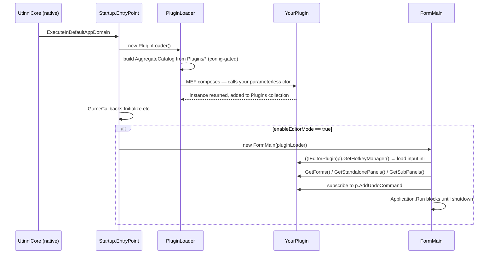

# Plugin framework

> Audience: all plugin authors. This is the **contract** — what your plugin
> implements, how Utinni discovers it, how it gets activated.

There are two plugin worlds:

1. **C++ native plugins** — DLLs loaded by `UtinniCore::PluginManager`. Run
   in the SWG client process, can do anything Utinni's native API allows,
   but no managed UI.
2. **.NET plugins** — DLLs loaded by `UtinniCoreDotNet::PluginLoader` via
   MEF. Run inside the in-process CLR. Have access to WinForms, the editor
   shell, the undo/redo system, hotkeys, etc.

You can ship both halves together (the Jawa Toolbox does — a tiny C++ DLL for
slash-command integration and a much larger C# DLL for the editor surface).

## .NET plugins

### `IPlugin`

`UtinniCoreDotNet/PluginFramework/IPlugin.cs`:

```csharp
[InheritedExport(typeof(IPlugin))]
public interface IPlugin
{
    PluginInformation Information { get; }
    UtINI GetConfig();
}

public class PluginInformation
{
    public string Name { get; }
    public string Description { get; }
    public string Author { get; }
    public PluginInformation(string name, string desc, string author) { ... }
}
```

Members:

- **`Information`** — display metadata. Surfaced in the editor's plugin
  list. Set this in your constructor.
- **`GetConfig()`** — return an instance of `UtinniCore.Utinni.UtINI`
  pointing at your plugin's `.ini` file, or `null` if you don't use config.
  Wraps the same INI library Utinni itself uses, so settings are visible to
  native code if you ever need it.

The `[InheritedExport]` attribute is what makes MEF pick the class up.
Don't add `[Export]` yourself — `[InheritedExport]` propagates to subclasses
of the *interface*, so every `IPlugin` implementor is automatically discovered.

### `IEditorPlugin` (extends `IPlugin`)

`UtinniCoreDotNet/PluginFramework/IEditorPlugin.cs`:

```csharp
[InheritedExport(typeof(IEditorPlugin))]
public interface IEditorPlugin : IPlugin
{
    EventHandler<AddUndoCommandEventArgs> AddUndoCommand { get; set; }

    HotkeyManager GetHotkeyManager();
    List<IEditorForm>         GetForms();
    List<SubPanelContainer>   GetStandalonePanels();
    List<SubPanel>            GetSubPanels();
}

public class AddUndoCommandEventArgs : EventArgs
{
    public IUndoCommand UndoCommand;
    public AddUndoCommandEventArgs(IUndoCommand cmd) { UndoCommand = cmd; }
}
```

Members:

- **`AddUndoCommand`** — an event you raise to push a command onto the
  editor's undo stack. `FormMain` subscribes its `UndoRedoManager.AddUndoCommand`
  method to your event during init.
- **`GetHotkeyManager()`** — return the plugin's `HotkeyManager` (or `null`).
  `FormMain.PanelGame.KeyDown` walks every plugin's manager and forwards
  keystrokes. Persistence is in `<plugin-assembly-dir>/input.ini`.
- **`GetForms()`** — return zero or more `IEditorForm`s. The editor opens
  them as separate child windows.
- **`GetStandalonePanels()`** — return zero or more `SubPanelContainer`s.
  Each becomes a tab in the right-rail's standalone-panel combo.
- **`GetSubPanels()`** — return zero or more `SubPanel`s. They dock
  inline in the editor's main right rail.

Any of these methods may return `null` if you don't use them.

### `IEditorForm`

```csharp
public interface IEditorForm
{
    string GetName();
    Form Create(IEditorPlugin editorPlugin, List<Form> parentChildren);
}
```

The `Create` method is called once when the editor opens; the form is then
the plugin's to own (show/hide/dispose). The `parentChildren` list is the
running collection of every editor-child form so plugins can coordinate
(useful for "raise only one of these at a time" etc.).

### `PluginLoader`

`UtinniCoreDotNet/PluginFramework/PluginLoader.cs`:

```csharp
public class PluginLoader
{
    [ImportMany(typeof(IPlugin))]
    public IEnumerable<IPlugin> Plugins;

    public PluginLoader() { Load(); }

    public void Load()
    {
        Plugins = new List<IPlugin>();
        var pluginDir = utinni.GetPath() + "/Plugins/";
        var catalog   = new AggregateCatalog(new DirectoryCatalog(pluginDir));

        var pluginManager = utinni.GetPluginManager();
        var configs = new List<PluginManager.PluginConfig>();
        for (int j = 0; j < pluginManager.PluginConfigCount; j++)
            configs.Add(pluginManager.GetPluginConfigAt(j));

        foreach (var pc in configs)
            if (pc.IsEnabled)
                catalog.Catalogs.Add(new DirectoryCatalog(pluginDir + pc.DirectoryName + "/"));

        var container = new CompositionContainer(catalog);
        container.ComposeParts(this);

        Log.Info(Plugins.Count() + " .NET Plugin(s) loaded");
    }
}
```

Two important details:

1. **The base `Plugins/` directory is always scanned.** A loose DLL dropped
   directly in `Plugins/` will be picked up — useful for one-file plugins.
2. **Subdirectories are gated by `ut.ini → [Plugins]`.** Only plugins listed
   there with `enabled=true` get their subdirectory added to the MEF
   catalog. The native `PluginManager` is the source of truth for both C++
   and .NET plugin gating.

### Activation lifecycle



So **your constructor runs on the CLR thread before the UI thread exists**.
If you want to wire callbacks that touch UI, do it in your constructor — by
the time your UI is touched, the editor will have called `GetSubPanels` etc.
on the UI thread.

### Minimal `IPlugin` skeleton

```csharp
using UtinniCore.Utinni;
using UtinniCoreDotNet.PluginFramework;
using UtinniCoreDotNet.Utility;

public class HelloPlugin : IPlugin
{
    public PluginInformation Information { get; }

    public HelloPlugin()
    {
        Information = new PluginInformation("Hello", "Demo runtime plugin", "Me");
        Log.Info("HelloPlugin constructed");
    }

    public UtINI GetConfig() => null;
}
```

That's the entire plugin. Drop the built DLL into `Plugins/Hello/Hello.dll`,
edit `ut.ini`:

```ini
[Plugins]
plugin_0 = true,Hello
```

…and it loads on next launch. `Log.Info` calls are visible in `utinni.log`.

### Minimal `IEditorPlugin` skeleton

```csharp
using System;
using System.Collections.Generic;
using UtinniCore.Utinni;
using UtinniCoreDotNet.Hotkeys;
using UtinniCoreDotNet.PluginFramework;
using UtinniCoreDotNet.UI.Controls;
using UtinniCoreDotNet.UI.Forms;

public class HelloEditorPlugin : IEditorPlugin
{
    public PluginInformation Information { get; }
    public EventHandler<AddUndoCommandEventArgs> AddUndoCommand { get; set; }

    public HelloEditorPlugin()
    {
        Information = new PluginInformation("Hello Editor", "Demo editor plugin", "Me");
    }

    public UtINI GetConfig() => null;
    public HotkeyManager GetHotkeyManager() => null;
    public List<IEditorForm> GetForms() => null;
    public List<SubPanelContainer> GetStandalonePanels() => null;
    public List<SubPanel> GetSubPanels() => null;
}
```

This produces an empty editor plugin — discoverable, gated, undo-event ready,
but contributing nothing. The [tutorial](tutorial.md) walks through adding
a SubPanel, a hotkey, a callback, and an undo command.

## C++ plugins

`UtinniCore/plugin_framework/utinni_plugin.h`:

```cpp
namespace utinni {
struct UtinniPlugin {
    struct Information {
        const char* name;
        const char* description;
        const char* author;
    };

    virtual void init() {}
    virtual const Information& getInformation() = 0;
};
}

#define UTINNI_PLUGIN extern "C" __declspec(dllexport) utinni::UtinniPlugin* createPlugin()
```

Each C++ plugin is a DLL that:

1. Subclasses `utinni::UtinniPlugin`.
2. Exports a `createPlugin()` factory via the `UTINNI_PLUGIN` macro.

### Discovery

`UtinniCore/plugin_framework/plugin_manager.cpp`:

1. Read `ut.ini → [Plugins]`. Each entry is `plugin_N = enabled,DirectoryName`
   (e.g. `plugin_0 = true,MyCppPlugin`).
2. For each *enabled* entry:
   - `LoadLibraryA("Plugins/<DirectoryName>/<DirectoryName>.dll")`
   - `GetProcAddress("createPlugin")` and invoke.
   - Push the returned `UtinniPlugin*` into the manager's list.
3. After all loaded → walk the list, call `init()` on each.

The `PluginConfig` struct exposed back to managed code:

```cpp
struct PluginConfig {
    bool   IsEnabled;
    char*  DirectoryName;
    // (plus internal handle/library state)
};
```

This is what `PluginLoader` reads to decide which subdirectories to add to
the MEF catalog. **The native config is the source of truth — disabling a
plugin in `ut.ini` disables both its C++ and its .NET halves.**

### Minimal C++ plugin

```cpp
// plugin.cpp
#include "utinni.h"
#include "swg/ui/cui_chat_window.h"
#include "example_command_parser.h"   // your own

class HelloCppPlugin : public utinni::UtinniPlugin
{
    Information info = { "Hello C++", "Demo native plugin", "Me" };

public:
    void init() override {
        utinni::CuiChatWindow::addCreateCommandParserCallback(
            &hello::HelloCommandParser::create);
    }

    const Information& getInformation() override { return info; }
};

UTINNI_PLUGIN { return new HelloCppPlugin(); }
```

Compile against `UtinniCore.lib`. Drop into `Plugins/HelloCpp/HelloCpp.dll`.
Add `[Plugins] plugin_0 = true,HelloCpp` to `ut.ini`.

### When to write C++ vs .NET

| Use C++ when…                                                                                | Use .NET when…                                              |
| -------------------------------------------------------------------------------------------- | ----------------------------------------------------------- |
| You need to detour a function Utinni doesn't already wrap (you'll add a new `swg/*` entry).  | You need editor UI (forms, panels, controls, drag-drop).    |
| You want to hook chat slash-commands at the lowest level.                                    | You want hotkeys, undo/redo, theming.                       |
| Throughput matters (per-frame, per-particle, per-draw).                                      | Productivity matters more than nanoseconds.                 |
| You're integrating an existing C++ codebase.                                                 | You want async work + WinForms idioms.                      |

A common composite: small C++ plugin for "register a chat command, raise a
managed event" + larger .NET plugin that does the actual editor work.

## Directory layout for a complete plugin

```
SwgClientDir/
├── SwgClient_r.exe                        ← the game
└── (Utinni install)/
    ├── Launcher.exe
    ├── UtinniCore.dll
    ├── UtinniCoreDotNet.dll
    ├── ut.ini                              ← references [Plugins] plugin_0=true,MyPlugin
    ├── utinni.cfg
    └── Plugins/
        └── MyPlugin/
            ├── MyPlugin.dll                ← C++ side (optional)
            ├── MyPluginDotNet.dll          ← .NET side (optional)
            ├── settings.ini                ← created on first run if needed
            ├── input.ini                   ← HotkeyManager persistence
            └── (your own assets, icons, etc.)
```

## Glossary

| Term                 | Meaning                                                                            |
| -------------------- | ---------------------------------------------------------------------------------- |
| **runtime plugin**   | `IPlugin` implementation. Loaded headless — does its work via callbacks.           |
| **editor plugin**    | `IEditorPlugin` implementation. Contributes UI to `FormMain`.                      |
| **SubPanel**         | A WinForms panel that docks inline on the editor's right rail. Plugins author them as subclasses of `UtinniCoreDotNet.UI.Controls.SubPanel`. |
| **SubPanelContainer**| A floating-window/tab grouping of `SubPanel`s. Surfaced via `GetStandalonePanels`. |
| **IEditorForm**      | A free-standing child window definition. Plugins return one or more.               |
| **PluginInformation**| Name/description/author triple shown in the editor.                                |
| **PluginConfig**     | Native struct (`enabled, directoryName`) read from `ut.ini → [Plugins]`.           |
| **AddUndoCommand**   | The plugin-side event you raise to push onto the editor's undo stack.              |

## See also

- [Callbacks reference](callbacks.md) — what to subscribe to inside your constructor.
- [UI framework](ui-framework.md) — how to author `SubPanel`s and `IEditorForm`s.
- [Hotkeys](hotkeys.md), [Undo / Redo](undo-redo.md).
- [Tutorial](tutorial.md) — assemble all of the above in 30 minutes.
- [SDK & templates](sdk.md) — `dotnet new` / Visual Studio path.
