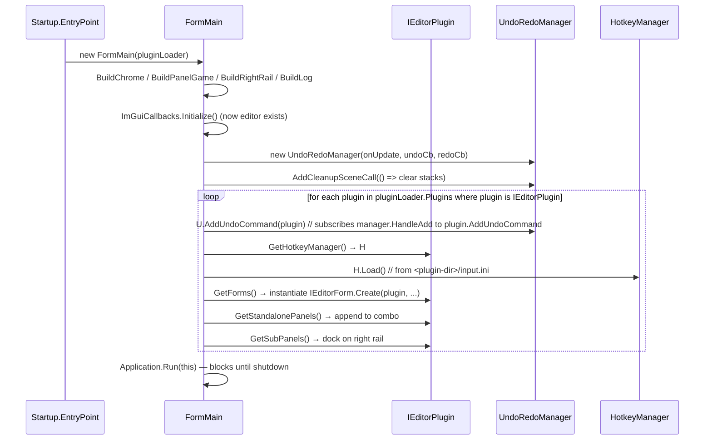

# UI framework

> Audience: .NET editor plugin authors.

Utinni's UI is **WinForms** with a custom dark theme, custom title bar, and a
purpose-built panel layout for embedding the live SWG client. Everything is
in the `UtinniCoreDotNet.UI` namespace.

## `FormMain` — the editor shell

`UI/Forms/FormMain.cs` is the editor window. It has:

- **Custom (frameless) chrome.** No native window title bar; instead, a
  `UtinniTitlebar` at the top with min/max/close and configurable buttons
  (e.g. undo/redo). Drag-to-move is implemented by sending `WM_NCLBUTTONDOWN`
  with `SC_DRAGMOVE` (see `Native.cs`).
- **Centre: `PanelGame`.** Hosts the embedded SWG client window. Handles
  game input plumbing and forwards `WndProc` to SWG's window proc.
- **Right rail:**
  - A combo at the top selects from `IEditorPlugin.GetStandalonePanels()` —
    each entry is a `SubPanelContainer` (multi-tab/grouped panels).
  - Below it, every `IEditorPlugin.GetSubPanels()` `SubPanel` is docked
    inline.
- **Bottom rail:** log viewer (driven by `Log.AddOuputSinkCallback`).

`FormMain`'s lifecycle:



## `PanelGame`

`UI/Controls/PanelGame.cs`. Re-parents SWG's window into a WinForms panel.

```csharp
protected override void WndProc(ref Message m)
{
    // Forward to SWG's window proc first (address from utinni::Client).
    IntPtr swgWndProc = new IntPtr(0x00AA0970);
    Native.CallWindowProc(swgWndProc, m.HWnd, m.Msg, m.WParam, m.LParam);
    // Then run WinForms processing (focus, input routing, etc.).
    base.WndProc(ref m);
}
```

Responsibilities beyond message forwarding:

- **Drag-drop wiring.** Calls `GameDragDropEventHandlers.Initialize(this)` —
  see below.
- **Focus tracking.** Updates a `HasFocus` flag used by `OnGameFocusOnly`
  hotkeys.
- **Cursor visibility.** Reference-counted via `cursorHideCount`.
- **Input suspension.** On mouse-enter resumes game input; on mouse-leave
  suspends it. ImGui hover state also counts as "not in game" for this
  purpose (so dragging an ImGuizmo handle doesn't also feed the game).
- **Key dispatch.** `PanelGame_KeyDown` iterates every plugin's
  `HotkeyManager` and calls `ProcessInput(modifierKeys, key, hasFocus)`.

## `SubPanel` and `SubPanelContainer`

`SubPanel` (subclass of WinForms `UserControl`) is the fundamental docking
unit for editor plugin UI:

- Width is normalised to 417px (the right-rail width).
- Inherits a `UtinniLabel` header with collapse/expand behaviour.
- Applies the active theme automatically — children should use `Utinni*`
  controls rather than vanilla WinForms ones.

`SubPanelContainer` is a vertical stack of `SubPanel`s — used when a plugin
wants to publish a grouped panel under the standalone-panels combo.

### Authoring a `SubPanel`

```csharp
using System;
using System.Windows.Forms;
using UtinniCoreDotNet.UI.Controls;
using UtinniCoreDotNet.Callbacks;
using UtinniCore.Utinni;

public class HelloSubPanel : SubPanel
{
    private readonly UtinniLabel lbl;
    private readonly UtinniButton btn;

    public HelloSubPanel() : base("Hello", expanded: true)   // header text + initial state
    {
        lbl = new UtinniLabel { Text = "scene: (none)", Dock = DockStyle.Top };
        btn = new UtinniButton { Text = "Print player position", Dock = DockStyle.Top };

        Controls.Add(btn);
        Controls.Add(lbl);

        btn.Click += (s, e) =>
        {
            GroundSceneCallbacks.AddUpdateLoopCall(() =>
            {
                var pos = Game.GetPlayer().GetTransform().Position;
                // marshal back to UI
                lbl.Invoke((MethodInvoker)(() =>
                    lbl.Text = $"player: ({pos.x:0.0}, {pos.y:0.0}, {pos.z:0.0})"));
            });
        };

        GameCallbacks.AddSetupSceneCall(() =>
            this.Invoke((MethodInvoker)(() =>
                lbl.Text = "scene: " + GroundScene.Get().GetName())));
    }
}
```

Return from your plugin:

```csharp
public List<SubPanel> GetSubPanels() => new List<SubPanel> { new HelloSubPanel() };
```

## Themed controls

`UI/Controls/`:

| Control                                              | Used for                                                  |
| ---------------------------------------------------- | --------------------------------------------------------- |
| `UtinniButton`                                       | Standard button. Honours theme + state scalars.           |
| `UtinniToggleButton`, `UtinniToggle`                 | Toggle/checkbox-style toggles with sticky visual state.   |
| `UtinniComboBox`                                     | Dropdown.                                                 |
| `UtinniTextbox`                                      | Text input.                                               |
| `UtinniNumericUpDown`                                | Numeric editor with up/down spinners.                     |
| `UtinniSlider`                                       | Horizontal slider.                                        |
| `UtinniLabel`                                        | Static text + section header (used inside `SubPanel`).    |
| `UtinniContextMenuStrip`                             | Context menu, themed.                                     |
| `UtinniTitlebarButton`, `UtinniTitlebarDropDownButton`, `UtinniTitlebarToggleButton` | Buttons that live in `FormMain`'s custom title bar.    |
| `UndoRedoListDropDown`, `UndoRedoTitlebarButton`     | The combined undo/redo button + history dropdown shown in the title bar. |

All of these read live colours from `UI/Theme/Colors.cs`:

```csharp
public static class Colors
{
    public enum Themes { Custom, Dark, Light }
    public static Themes Theme = Themes.Dark;

    public const float DisabledScalar  = 0.8f;
    public const float HighlightScalar = 1.25f;
    public const float PressedScalar   = 1.5f;

    public static Color Primary();
    public static Color Secondary();
    public static Color Font();
    public static Color FontDisabled();
    public static Color ControlBorder();
}
```

To recolour the whole UI, set `Colors.Theme = Themes.Light` (or `Custom` and
override the methods). The controls don't cache colours — every paint re-reads,
so the change is immediate.

`UI/Theme/ThemeUtility.cs`:

```csharp
ThemeUtility.UpdateImageColor(bitmap, oldColor, newColor);  // recolour an icon to fit the theme
ThemeUtility.ScaleColor(c, scalar);                          // multiply RGB
ThemeUtility.ClampColor(int v, int max = 255);
```

## Drag-drop bridge

`UI/GameDragDropEventHandlers.cs` exposes four static delegates that any code
can subscribe to. They fire when something is dragged into / over / out of /
dropped on the embedded `PanelGame`:

```csharp
public static class GameDragDropEventHandlers
{
    public static DragEventHandler OnDragDrop;
    public static DragEventHandler OnDragEnter;
    public static EventHandler     OnDragLeave;
    public static DragEventHandler OnDragOver;

    public static void Initialize(Control gamePanel);   // called by PanelGame
}
```

A plugin that wants to enable drag-from-list-to-world subscribes inside its
own handler:

```csharp
GameDragDropEventHandlers.OnDragEnter += MyBrowser_HandleDragEnter;
GameDragDropEventHandlers.OnDragOver  += MyBrowser_HandleDragOver;
GameDragDropEventHandlers.OnDragDrop  += MyBrowser_HandleDragDrop;
```

The Jawa Toolbox's `FormObjectBrowser` uses this to spawn temporary objects
in the live world as the user drags from the object list. See
[UtinniPlugins/docs/jawa-toolbox.md](../../../UtinniPlugins/docs/ai/jawa-toolbox.md#object-browser).

## Standalone panels and `IEditorForm`s

`IEditorForm` is for free-standing tool windows (modeless dialogs). The
Jawa Toolbox uses it for the Object Browser:

```csharp
public class FormObjectBrowserDef : IEditorForm
{
    public string GetName() => "Object Browser";

    public Form Create(IEditorPlugin editorPlugin, List<Form> parentChildren)
    {
        var form = new FormObjectBrowser(editorPlugin);
        parentChildren.Add(form);
        return form;
    }
}

public class MyPlugin : IEditorPlugin
{
    public List<IEditorForm> GetForms() =>
        new List<IEditorForm> { new FormObjectBrowserDef() };
}
```

`SubPanelContainer` is for grouped right-rail tabs:

```csharp
public List<SubPanelContainer> GetStandalonePanels()
{
    var container = new SubPanelContainer("Controls");
    container.Add(new ScenePanel());
    container.Add(new SnapshotPanel());
    return new List<SubPanelContainer> { container };
}
```

## Anatomy of a custom title bar

If you want to add a button to `FormMain`'s title bar from a plugin, you have
two options:

1. **Title-bar dropdown** — return `UtinniTitlebarDropDownButton`s from your
   plugin (currently this is plumbed via the standalone-panels mechanism;
   see `FormMain` for the exact attachment point).
2. **Roll your own form chrome** — for `IEditorForm`-returned windows, you
   can opt into the same headless-chrome pattern by implementing
   `WndProc` similarly to `FormMain`. See `Native.cs` for the constants:

```csharp
protected override void WndProc(ref Message m)
{
    if (m.Msg == Native.WM_NCHITTEST)
    {
        var p = PointToClient(Cursor.Position);
        if (p.Y < titleBarHeight) { m.Result = (IntPtr)Native.WM_HitTests.HTCAPTION; return; }
    }
    base.WndProc(ref m);
}
```

## Patterns

### Async UI updates without blocking the game

```csharp
private async Task PollViewAsync()
{
    while (!IsDisposed)
    {
        await Task.Delay(100);   // 10 Hz UI refresh

        // Pull state on the game thread...
        var tcs = new TaskCompletionSource<float>();
        GroundSceneCallbacks.AddUpdateLoopCall(() =>
            tcs.SetResult(Terrain.Get().GetTimeOfDay()));
        var tod = await tcs.Task;

        // ...then push to UI.
        this.Invoke((MethodInvoker)(() => lblTod.Text = $"ToD: {tod:0.00}"));
    }
}
```

### Enabling/disabling controls per game state

```csharp
public HelloSubPanel()
{
    btn.Enabled = false;
    GameCallbacks.AddSetupSceneCall(() =>
        this.Invoke((MethodInvoker)(() => btn.Enabled = true)));
    GameCallbacks.AddCleanupSceneCall(() =>
        this.Invoke((MethodInvoker)(() => btn.Enabled = false)));
}
```

### Reading from `ut.ini` for plugin settings

```csharp
var ini = new UtINI("settings.ini");          // resolves relative to plugin assembly dir
ini.AddSetting("UI", "panelWidth", "417", UtINI.Value.Types.VtInt);
ini.Load();
int w = ini.GetInt("UI", "panelWidth");
```

## Don'ts

- **Don't use vanilla WinForms controls** (`Button`, `TextBox`, etc.) in
  Utinni UI — they ignore the theme and look out of place. Use `Utinni*`.
- **Don't anchor controls expecting flexible width.** The right rail is a
  fixed 417 px; anchor `Left`/`Right` instead of `Fill`.
- **Don't call `MessageBox.Show` from a game-thread callback.** Marshal first.
- **Don't open `Application.OpenForms` from a constructor** — `FormMain`
  isn't built yet at that point.

## See also

- [Bridge](bridge.md) — where `UI/` sits in the broader picture.
- [Plugin framework](plugin-framework.md) — how `GetSubPanels()` /
  `GetForms()` / `GetStandalonePanels()` are consumed by `FormMain`.
- [Hotkeys](hotkeys.md), [Undo / Redo](undo-redo.md).
- The Jawa Toolbox's panels are the canonical worked example:
  [UtinniPlugins/docs/jawa-toolbox.md](../../../UtinniPlugins/docs/ai/jawa-toolbox.md).
